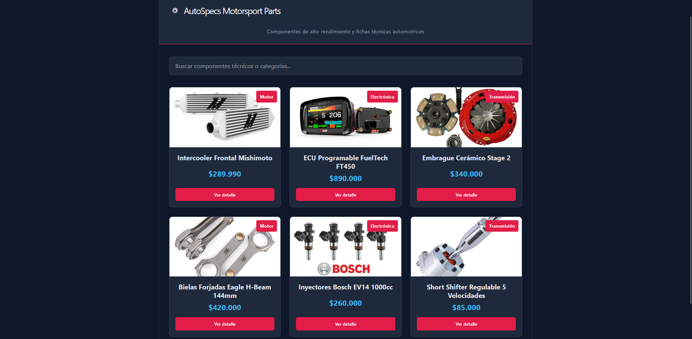
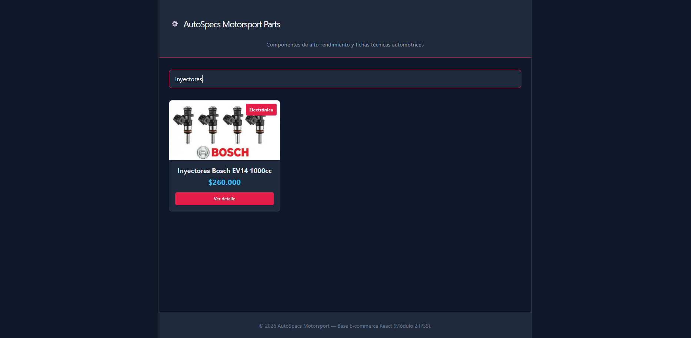

# AutoSpecs Motorsport - E-commerce Components en React

> Módulo 2: Desarrollo de Interfaces Dinámicas con React — IPSS

## Descripción del Proyecto
Base modular para la tienda de repuestos y componentes mecánicos de alto rendimiento. Desarrollado con React funcional y Vite, aplicando arquitectura de componentes reutilizables, paso de datos mediante props y manejo de estado local.

## Componentes Custom Creados
1. **Header:** Muestra el isotipo, nombre de la tienda y slogan descriptivo mediante props.
2. **SearchBar:** Componente con input controlado conectado a un estado padre para filtrado en vivo.
3. **Button:** Botón configurable mediante variantes (`primary`, `secondary`) y eventos `onClick`.
4. **ProductCard:** Tarjeta individual que recibe los datos de cada producto vía props y despacha acciones.
5. **ProductList:** Contenedor que itera la colección con `.map()` implementando claves únicas (`key`).
6. **Footer:** Sección de cierre con información de copyright y año dinámico.

## Tecnologías Utilizadas
- **React 18 / 19**
- **Vite**
- **JavaScript ES6+**
- **CSS3 Flexbox / Grid**

## Capturas de Pantalla

### Vista General


### Búsqueda y Selección Interactiva


## Instrucciones para Ejecutar Localmente

1. Clonar el repositorio:
```bash
git clone https://github.com/VixoVixey/autospecs-store.git
cd autospecs-store
```

2. Instalar dependencias:
```bash
npm install
```

3. Levantar entorno de desarrollo:
```bash
npm run dev
```